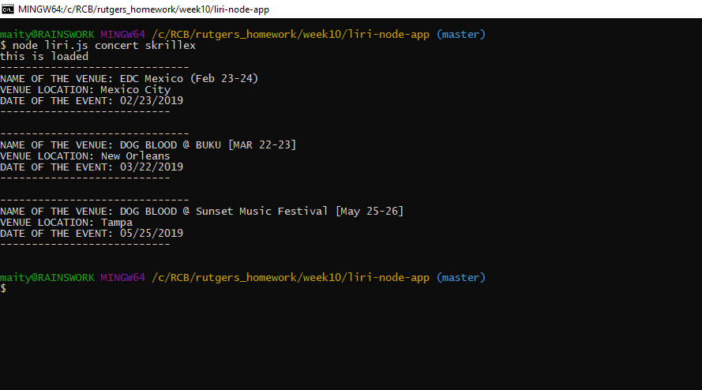
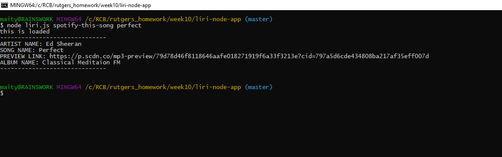
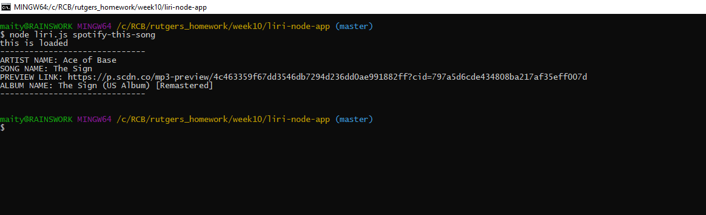
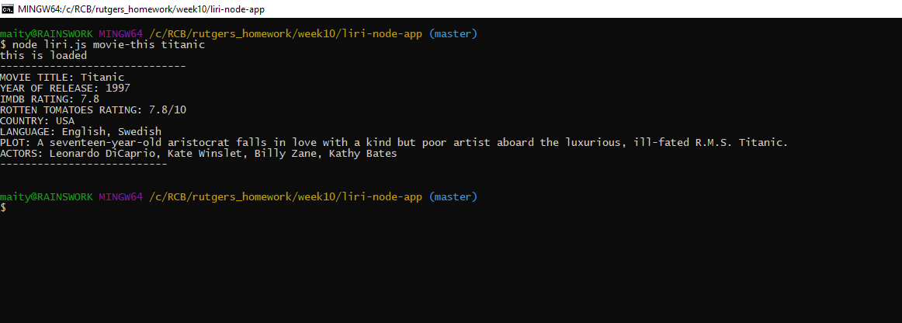
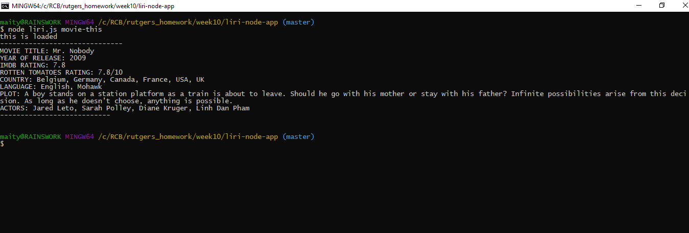
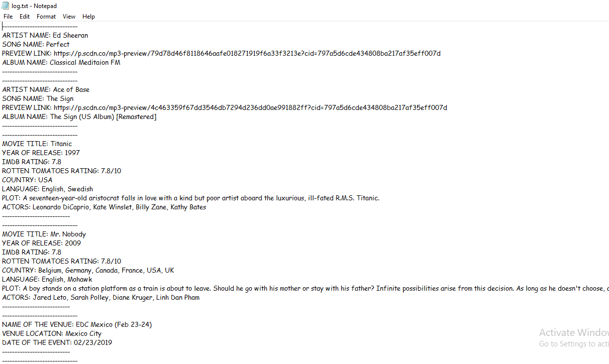

# liri-node-app

https://drive.google.com/file/d/1FYaQ0HNZ6ySKA763y5-KLMNLzscjgcI4/view

LIRI is like iPhone's SIRI. However, while SIRI is a Speech Interpretation and Recognition Interface, LIRI is a _Language_ Interpretation and Recognition Interface. LIRI will be a command line node app that takes in parameters and gives you back data.

####Liri.js can take in one of the following commands:

  concert-this '<artist/band name here>'
  
  node liri.js spotify-this-song '<song name here>'

  node liri.js movie-this '<movie name here>'

  node liri.js do-what-it-says
  
####node liri.js concert-this _artist/band name here

This will search the Bands in Town Artist Events API for an artist and render 'Name of the venue','Venue location' and 'Date of the Event' about each event 

liri.js concert-this skrillex

####node liri.js spotify-this-song '<song name here>'
  
This will show the following information about the song in the terminal/bash window to retrive the information from Spotify API

    *Artist(s)
    
    * The song's name
    
    * A preview link of the song from Spotify
    
    * The album that the song is from  
    
liri.js spotify-this-songs perfect   
  

####Without song Liri will choose default song "The Sign" by Ace of Base

liri.js spotify-this-songs

####node liri.js movie-this '<movie name here>'
  
This will show the following information to the terminal/bash window to retrive the information from OMDB API.

    * Title of the movie.
    
    * Year the movie came out.
    
    * IMDB Rating of the movie.
    
    * Rotten Tomatoes Rating of the movie.
    
    * Country where the movie was produced.
    
    * Language of the movie.
    
    * Plot of the movie.
    
    * Actors in the movie.
    
liri.js movie-this titanic
 

####Without movie Liri will choose default movie "Mr. Nobody"
liri.js movie-this

####node liri.js do-what-it-says

Using the fs Node package, LIRI will take the text inside of random.txt and then use it to call spotify-this-song "I Want it That Way," as follows the text in random.txt

####These commands will log data into a log.txt file.

  * concert-this
  
  * spotify-this-song
  
  * movie-this
  
  * do-what-it-says
  
  
